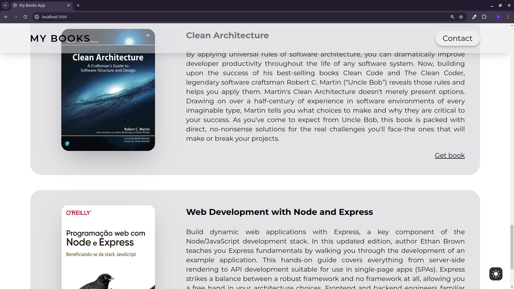

# My Books App

# Installation

After cloning the repository or downloading the ZIP file, run one of the following commands to install the dependencies:

npm install

yarn

pnpm install

## Running the Project

To start the project in development mode, use one of the following commands:

yarn dev

npm run dev

pnpm dev

bun dev

These codes create a webpage displaying a list of web development and programming books. They use React with Framer Motion for animations. The BookCard component shows each book with an image, title, description, and a link to get the book. Book data is stored in a file called card-datas.js. The BooksList component organizes the book list on the page using styles for layout. Overall, the codes offer a modular, reusable approach with smooth animations for a better user experience.

[Visit the Live Site](https://hiroshibooks.vercel.app/)

